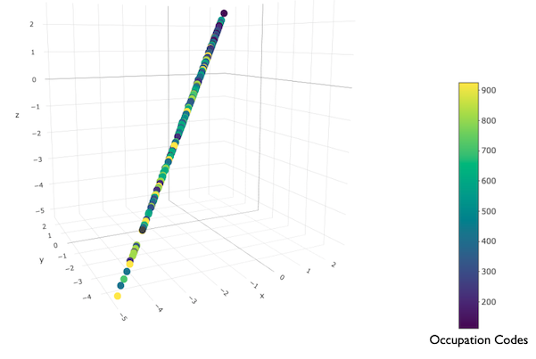
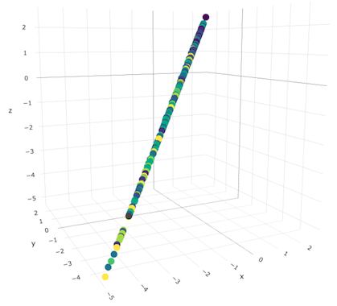

class: full-slide-fig


```{r setup, include = FALSE}
knitr::opts_chunk$set(
  fig.asp = 9/16,
  fig.align = 'center',
  echo = F,
  message = F,
  warning = F,
  out.width = "80%",
  dpi= 300
)
```

```{r xaringan-themer, include=FALSE, warning=FALSE}
library(xaringanthemer)
style_mono_accent(
  base_color = "#353889",
  header_font_google = google_font("Lato", "400"),
  text_font_google   = google_font("Newsreader"),
  text_font_size = "1.4rem",
  title_slide_background_image = "demosoctitle.png"
)
```

```{r xaringan-logo, echo=FALSE}
library(xaringanExtra)
use_logo(
  image_url = "https://waronimmigrants.github.io/images/demosoc_logo.png",
  width = "242px",
  height = "39px",
  position = css_position(top = "1em", right = "1em")
)

```

```{r}
source("/Users/kimberlygoulart/UPF PhD/Stats:Research Resources/R/r_startup.R")
models <- read_dta("~/UPF PhD/Thesis/Paper 1 - scarring effects on job quality/Data/R/models2_data.dta")
long_clean <- read_dta("~/UPF PhD/Thesis/Paper 1 - scarring effects on job quality/Data/R/long_clean.dta")

setwd("~/UPF PhD/Thesis/Paper 1 - scarring effects on job quality/Data/R/")

load("m1.rda")
load("m3.rda")
load("m2.rda")
load("m4.rda")
load("m5.rda")
load("m6.rda")

library(sjlabelled)
library(sjPlot)
library(factoextra)
library(FactoMineR)
library(corrplot)
library(ggpubr)

```

##Table of Contents

- Introduction & Research Question

- Previous Literature

- Hypotheses

- Data & Methodology

- Results

- Discussion

---
## Research Questions

1. Is there a link between an unemployment spell and future job quality?

2. Does an unemployment spell leave a scar on future job quality?

---
## Scarring Literature
- Primary focus in the past has been on monetary rewards, i.e. wages

- Two Key Mechanisms:

  - Human capital depreciation (Becker, 1964)

  - Signaling (Spence, 1973)

---
## Previous Scarring Literature on Non-monetary Rewards
- Brand (2006) followed displaced workers in WI, USA.

  - Blue-collar workers saw a decrease in their employer-sponsored benefits.

  - White-collar workers saw a decrease in their job content, i.e. autonomy and authority.

- Diekoff (2011) conducted a cross-national comparative analysis of four countries.

  - Found key country differences due to institutional factors.

  - Used a select set of job quality measures.

---
## Job Quality Definition
- There is no consensus on what is considered a “good” or “bad” job.

- Autonomy and control over one’s tasks is almost universally included in job quality definitions.

- Braverman (1975) and other Marxist sociologists argued that there was a trend of “deskilling the worker.”

- The dimensions of job security has gained traction due to neoliberal policies to increase flexibility in the labor markets.

- The biggest disagreement is over the use of job satisfaction.

---
## Hypotheses
- H1: Unemployment penalty - An unemployment spells leads to reductions in job quality.

- H2: Scarring effect - An unemployment spell results in a scar that reduces job quality and can linger beyond a year after re-employment.

- H3: Key gender differences - It is possible that women experience harsher unemployment penalties and scarring effects than men.

---
## Data and Methodology
- Sample:

  - UK Understanding Society Survey (2009 - 2019)

  - Limited to working age adults (25-55) at the start of their entrance into the survey

  - Self-employed individuals were dropped.

  - Each individual had to report at least one job quality score before and after the unemployment spell.

- Limitations:

  - Working conditions module was conducted every even-numbered wave, therefore a three-wave average was computed for the job quality scores to smooth the data.

---
## Data and Methodology (cont.)
- The dependent variables of job quality are created using a Principal Component Analysis (PCA) which seeks to reduce the dimensionality of a larger set of variables.

- The job quality dimensions used in the analysis follow Green and Mostafa's definiton of job quality, which includes autonomy, authority, work intensity, work-life balance, and job security.

- The main independent variables of interest are:
  - Unemployment penalty - If the person has any unemployment spell in their history (binary)
  
  - Scarring penalty - time since re-entry into the formal workforce (categorical)

---
## Data and Methodology (cont.)
- The analysis consists of separate random effects within and between (REWB) regression models that estimate the extent to which unemployment spells lead to reductions in job quality.

-  To be clear, the within effect (i.e. fixed effects) estimations are prioritized in this analysis, as the  main focus is to determine how unemployment spells affect changes in job quality within individuals.

- However Bell & colleagues advocate for the usage of REWB models, which can provide additional context when looking at between groups. 

- Furthermore the inclusion of interaction effects require mixed effects models, as some time-invariant variables of interest (e.g. gender) would not be included in the fixed effects only models.

---
## Institutional Context

- The UK labour market is marked by increased flexibility, with relatively little employment protection.

- In contrast to its European neighbours, the UK labour market did not experience unprecedented high unemployment rates during the Great Recession.

```{r, out.width = "60%"}
dtable <- models %>%
  group_by(wave) %>%
  summarise(uerate = mean(ifelse(jobstat==2, 1, 0), na.rm = T) %>%
              na.omit())

ggplot(dtable, aes(wave, uerate)) +
  geom_point() +
  geom_line() +
  scale_x_continuous(breaks=seq(0, 9, by = 2)) +
  labs(x = "Wave", y = "Unemployment Rate") +
  theme_minimal()
```

---
## PCA Results

- PCA on 9 variables was conducted to create a job quality index.
```{r}

# JOB QUALITY_OBJECTIVE (no subjective job security, no rolling averages)
df_dims <- long_clean %>%
  ungroup() %>%
  select(auttask, autmanner, autorder, manager, autpace, authours, flex, ft, perm)
results_pca <- prcomp(na.omit(df_dims),center = T, scale = T, retx = T)
scores_ob <- predict(results_pca, newdata = df_dims)


# Flipped y axis
fviz_pca_var(results_pca,
             axes=c(1,2),
             repel=TRUE,
             col.var="contrib",
             gradient.cols=c("white","#f47a27", "#ed4040"),
             ggtheme=theme_minimal()) + xlim(c(1,-1)) + ylim(c(1,-1))


```

---
## PCA Results (cont.)

```{r}
var <- get_pca_var(results_pca)
rownames(var[["cos2"]]) <- c("Task", "Manner", "Order", "Manager", "Pace", "Hours", "FlexHrs", "FT", "Perm")
corrplot(var$cos2, is.corr = F, method = "shade", tl.col = "black")
taskplot <- long_clean %>%
  ungroup() %>%
  select(auttask, autmanner, autorder, manager, autpace, authours, flex, ft, perm)

```

---
## PCA Results (cont.)

- Dependent variables

  - PC1 - Represents overall job quality
  
  - PC2 - Represents job security
  
Table 1: Variance Table

| Variable | PC1 | PC2 | PC3 | PC4
|------:|:-----|---------|:------:|:------:|
| Standard Deviation | 1.89  |  1.12  | 1.03  | 1.01
| Proportion of Variance | 0.39 | 0.13 | 0.12 | 0.10
| Cumulative Proportion  | 0.39 | 0.52 | 0.64 | 0.74
---
## Descriptives

```{r}
models$occ_class <- factor(models$occ_class,
                           levels = c(1, 2, 3, 4),
                           labels = c("Prof/Manager", "Skilled non-manual", "Skilled manual", "Part/Unskilled"))
models$gender <- factor(models$gender,
                        levels = c(0, 1),
                        labels = c("Men", "Women"))

dtable1 <- models %>%
  group_by(occ_class) %>%
  summarise(PC1mean = mean(PC1, na.rm = TRUE),
            count=n(),
            se=sd(PC1/sqrt(count), na.rm = T)) %>%
  na.omit()

occplot <- ggplot(dtable1, aes(occ_class, PC1mean)) +
  geom_bar(stat="identity", width=0.8) +
  labs(x = NULL, y = NULL, title = "Occupational Class") +
  theme_minimal() +
  theme(axis.text.x = element_text(angle = -35)) +
  geom_errorbar(aes(ymin=PC1mean-se, ymax=PC1mean+se), colour="grey", width=0.2)

dtable2 <- models %>%
  group_by(agegrps) %>%
  summarise(PC1mean = mean(PC1, na.rm = TRUE),
            count=n(),
            se=sd(PC1/sqrt(count), na.rm = T)) %>%
  na.omit()

ageplot <- ggplot(dtable2, aes(agegrps, PC1mean)) +
  geom_bar(stat="identity", width=0.8) +
  labs(x = NULL, y = NULL, title = "Age Groups") +
  theme_minimal() +
  theme(axis.text.x = element_text(angle = -35)) +
  geom_errorbar(aes(ymin=PC1mean-se, ymax=PC1mean+se), colour="grey", width=0.2)

dtable3 <- models %>%
  group_by(gender) %>%
  summarise(PC1mean = mean(PC1, na.rm = TRUE),
            count=n(),
            se=sd(PC1/sqrt(count), na.rm = T)) %>%
  na.omit()

genderplot <- ggplot(dtable3, aes(gender, PC1mean)) +
  geom_bar(stat="identity", width=0.8) +
  labs(x = NULL, y = NULL, title = "Gender") +
  theme_minimal() +
  theme(axis.text.x = element_text(angle = -35)) +
  geom_errorbar(aes(ymin=PC1mean-se, ymax=PC1mean+se), colour="grey", width=0.2)

figure <- ggarrange(occplot, ageplot, genderplot, ncol = 3, nrow = 1)
annotate_figure(figure,
                top = text_grob("PC1 Job Quality", size = 14))


```

---
## Hypothesis 1: Unemployment Penalty

```{r}

m1plot.w <- plot_model(m1, show.values = TRUE, value.offset = .3, title = "PC1 Within", terms = c("has_ue", "marr", "numchild", "edOther", "edDegree", "edA-level/less", "jobsize25-99", "jobsize100-499", "jobsize500+", "occ_classsprof/manager", "occ_classskilled non-man", "occ_classskilled man", "occ_classpart/unskill")) +
  scale_color_sjplot(palette = "circus")

m3plot.w <- plot_model(m3, show.values = TRUE, value.offset = .3, title = "PC2 Within", terms = c("has_ue", "marr", "numchild", "edOther", "edDegree", "edA-level/less", "jobsize25-99", "jobsize100-499", "jobsize500+", "occ_classsprof/manager", "occ_classskilled non-man", "occ_classskilled man", "occ_classpart/unskill")) +
  scale_color_sjplot(palette = "circus")
ggarrange(m1plot.w, m3plot.w)

```

---
## Hypothesis 2: Scarring Effect
```{r}

m2plot.w <- plot_model(m2, show.values = TRUE, value.offset = .3, title = "PC1 Within", terms = c("timesince_ue<6 mos", "timesince_ue6-11 mos", "timesince_ue12-23 mos", "timesince_ue24+ mos", "marr", "numchild", "edOther", "edDegree", "edA-level/less", "jobsize25-99", "jobsize100-499", "jobsize500+", "occ_classsprof/manager", "occ_classskilled non-man", "occ_classskilled man", "occ_classpart/unskill")) +
  scale_color_sjplot(palette = "circus")

m4plot.w <- plot_model(m4, show.values = TRUE, value.offset = .3, title = "PC2 Within", terms = c("timesince_ue<6 mos", "timesince_ue6-11 mos", "timesince_ue12-23 mos", "timesince_ue24+ mos", "marr", "numchild", "edOther", "edDegree", "edA-level/less", "jobsize25-99", "jobsize100-499", "jobsize500+", "occ_classsprof/manager", "occ_classskilled non-man", "occ_classskilled man", "occ_classpart/unskill")) +
  scale_color_sjplot(palette = "circus")
ggarrange(m2plot.w, m4plot.w)

```

---
## Interaction: Scarring Effect by Gender
```{r}

m5plot.w <- plot_model(m5, show.values = TRUE, value.offset = .3, title = "PC1 Within", terms = c("timesince_ue<6 mos:gender", "timesince_ue6-11 mos:gender", "timesince_ue12-23 mos:gender", "timesince_ue24+ mos:gender" )) +
  scale_color_sjplot(palette = "circus")

m6plot.w <- plot_model(m6, show.values = TRUE, value.offset = .3, title = "PC2 Within", terms = c("timesince_ue<6 mos:gender", "timesince_ue6-11 mos:gender", "timesince_ue12-23 mos:gender", "timesince_ue24+ mos:gender" )) +
  scale_color_sjplot(palette = "circus")
ggarrange(m5plot.w, m6plot.w)

```

---
## Conclusion
- The European policy priority continues to be full employment, but this analysis suggests that unemployment can lead to scars on future job outcomes and possibly longer term career trajectories.

- The scarring literature speaks little about the intragenerational effect that unemployment spells have on future life outcomes and career trajectories, outside of wages.

- Future research should consider:

  - If spells of non-employment also result in similar scars.

  - If the signaling mechanism also plays a role in scars of job quality.

  - How can individuals best combat negative signals that arise from spells of unemployment.

---
## Discussion
Thank you!

---
## References:
- Becker, G. S. (1964). Human Capital. A Theoretical and Empirical Analysis with Special Reference to Education. The National Bureau of Economic Research, third edition.
- Bell, A., Fairbrother, M., & Jones, K. (2019). Fixed and random effects models: making an informed choice. Quality and Quantity, 53(2), 1051–1074.
- Brand, J. E. (2006). The effects of job displacement on job quality: Findings from the Wisconsin Longitudinal Study. Research in Social Stratification and Mobility, 24(3):275–298. 
- Braverman, H. (1975). The making of the US working class. Pacifica Radio.
- Dieckhoff, M. (2011). The effect of unemployment on subsequent job quality in Europe: A comparative study of four countries. Acta Sociologica, 54(3):233–249. 
- Green, F., Mostafa, T., Parent-Thirion, A., Vermeylen, G., van Houten, G., Biletta, I., & Lyly- Yrjanainen, M. (2013). Is job quality becoming more unequal? ILR Review, 66(4), 753–784.
- Spence, M. (1973). Job Market Signaling. The Quarterly Journal of Economics1, 87(3):355–374. 

---
## Robustness Checks

Clustering around waves
```{r}
robust_dims <- long_clean %>%
  ungroup() %>%
  select(auttask, autmanner, autorder, manager, autpace, authours, flex, ft, perm, wave)
results_pca_wave <- prcomp(na.omit(robust_dims),center = T, scale = T, retx = T, )
scores_ob_wave <- predict(results_pca_wave, newdata = robust_dims )

wave_loading <- data.frame(results_pca_wave$rotation)

var_wave <- get_pca_var(results_pca_wave)
var <- get_pca_var(results_pca_wave)
rownames(var_wave[["cos2"]]) <- c("Task", "Manner", "Order", "Manager", "Pace", "Hours", "FlexHrs", "FT", "Perm", "Wave")
corrplot(var_wave$cos2, is.corr = F, method = "shade", tl.col = "black")

```

---
##Robustness Checks (cont.)

PCA stability

 
